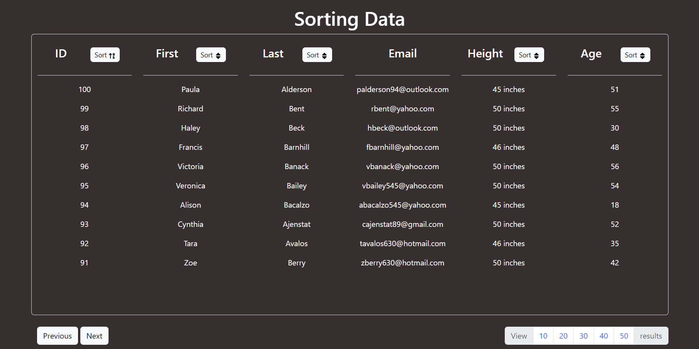

# Sorting Data &nbsp;&nbsp;

**Name:** Elizabeth Trotter

### Project Scope: 

This was a `single day sprint` challenge where I built out a `data sorting app` that allows you to sort in ascending and descending order in each field. This was a `desktop build` that utilized `vanilla JavaScript`, `HTML`, and the `Bootstrap Framework`. 

- This challenge was fun to work on, and I had the opportunity to learn more about the `.sort()` method. The code could use some refactoring if it is to be revisited in the future.

- Click :point_right: [here](#desktop-preview) to scroll down to a preview of the task tracking app in action or check the status badge above to view the deployed website.

> [!NOTE]  
> The project focused on functionality first, meeting the client's requirements, and supplying a working product prior to the deadline. There is opportunity to improve the UI & UX design and responsiveness, if desired. 

***Client Requirements:***

- [x] Formatted
- [x] Pagination
- [x] Able to display 10, 20, 30, 40, 50 results at a time
- [x] Sort By
    - ID
    - First Name
    - Last Name
    - Height
    - Age
- [x] Use creating elements
- [x] Tested
- [x] Vanilla JavaScript
- [x] Desktop build

### Desktop Preview

Figure 1: Desktop preview of data sorter with sorted ID's in descending order & viewing 10 results at a time
